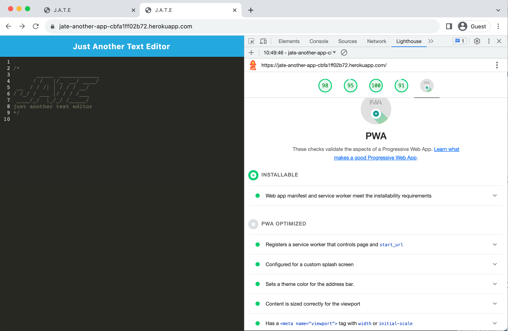
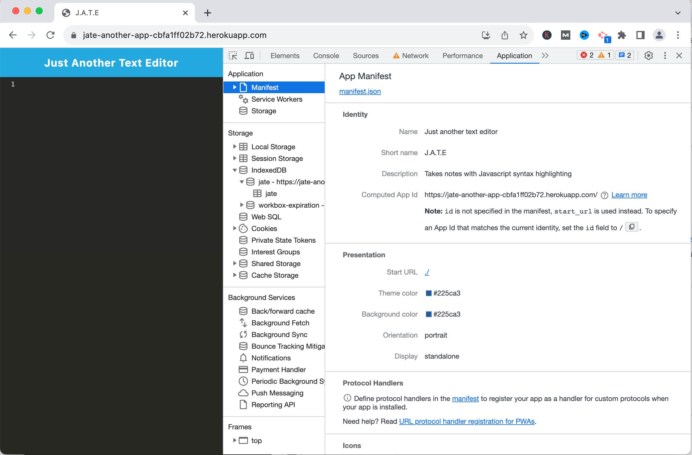
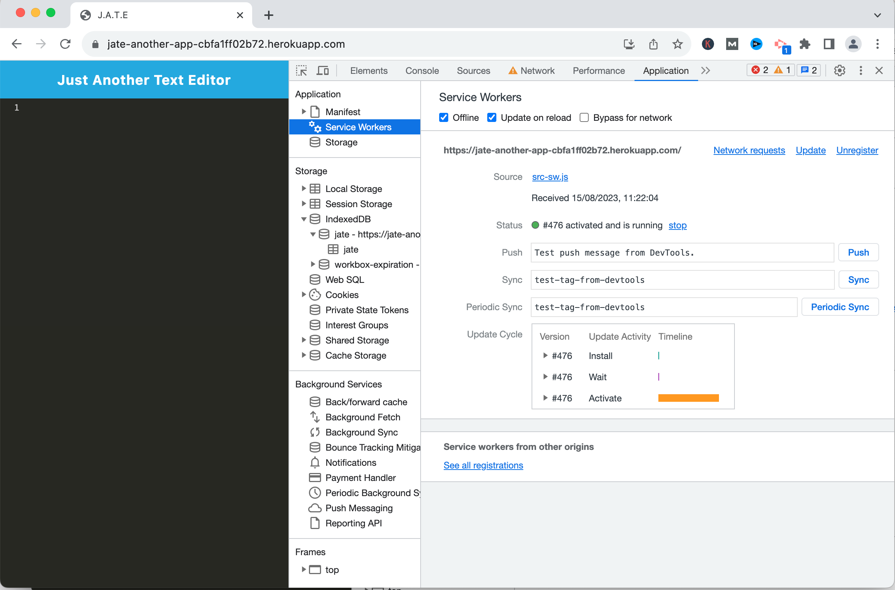

# jate-app

This is a Single Page Text Editor using Progressive Web Application (PWA).
it will also use IndexDB to store lightweight data locally.

## User Story


```md
AS A developer
I WANT to create notes or code snippets with or without an internet connection
SO THAT I can reliably retrieve them for later use
```

## Acceptance Criteria

```md
GIVEN a text editor web application
WHEN I open my application in my editor
THEN I should see a client server folder structure
WHEN I run `npm run start` from the root directory
THEN I find that my application should start up the backend and serve the client
WHEN I run the text editor application from my terminal
THEN I find that my JavaScript files have been bundled using webpack
WHEN I run my webpack plugins
THEN I find that I have a generated HTML file, service worker, and a manifest file
WHEN I use next-gen JavaScript in my application
THEN I find that the text editor still functions in the browser without errors
WHEN I open the text editor
THEN I find that IndexedDB has immediately created a database storage
WHEN I enter content and subsequently click off of the DOM window
THEN I find that the content in the text editor has been saved with IndexedDB
WHEN I reopen the text editor after closing it
THEN I find that the content in the text editor has been retrieved from our IndexedDB
WHEN I click on the Install button
THEN I download my web application as an icon on my desktop
WHEN I load my web application
THEN I should have a registered service worker using workbox
WHEN I register a service worker
THEN I should have my static assets pre cached upon loading along with subsequent pages and static assets
WHEN I deploy to Heroku
THEN I should have proper build scripts for a webpack application
```


## Installation
  
to install for running in localhost, just exceute the following:

  ```md
  npm i 
  ```

that would install the following package:
1.  Express.  It is a fast, and minimalist web framework for Node.js that simplifies the process of building web applications and APIs by providing a robust set of features for routing, middleware, template engines, and more.
2. babel-loader. It is a Webpack loader that transpiles JavaScript files using Babel and Webpack.
3. css-loader. It is a Webpack loader that resolves and interprets CSS imports, converting them into JavaScript modules.
4. html-webpack-plugin. It is a plugin for Webpack that simplifies the creation of HTML files to serve bundled Webpack output.
5. mini-css-extract-plugin. It is a Webpack plugin that extracts CSS into separate files, optimizing the loading process for styles in Webpack builds.
6. webpack. It is a powerful module bundler that bundles JavaScript files, assets, and other resources into a single package.
7. workbox-webpack-plugin. It is a Webpack plugin that generates a service worker to enable robust caching and offline support for web applications using the Workbox library.

## Technologies Used

This application is built using the following technologies:

- **JavaScript**: Programming language for adding interactivity and dynamic content.
- **NodeJS**: an open-source, cross-platform, JavaScript runtime environment that executes JavaScript code outside of a web browser.
- **Express**: A minimal and flexible Node.js web application framework that provides a robust set of features for web and mobile applications, such as routing, and middleware setup.
- **babel-loader**: It is a Webpack loader that transpiles JavaScript files using Babel and Webpack.
- **css-loader**: It is a Webpack loader that resolves and interprets CSS imports, converting them into JavaScript modules.
- **html-webpack-plugin**: It is a plugin for Webpack that simplifies the creation of HTML files to serve bundled Webpack output.
- **mini-css-extract-plugin**: It is a Webpack plugin that extracts CSS into separate files, optimizing the loading process for styles in Webpack builds.
- **webpack**: It is a powerful module bundler that bundles JavaScript files, assets, and other resources into a single package.
- **workbox-webpack-plugin**: It is a Webpack plugin that generates a service worker to enable robust caching and offline support for web applications using the Workbox library.

## Usage

The user should clone the repository and run 'npm i' to install the following: 

- express
- babel-loader
- css-loader
- html-webpack-plugin
- mini-css-extract-plugin
- webpack
- workbox-webpack-plugin


for localhost:
then run 'npm run start:dev' to invoke the backend.

for heroku app, please go to :
https://jate-another-app-cbfa1ff02b72.herokuapp.com/


## Features

The application is a text editor.
Include the saving the data into IndexDB.
having the service worker to cache the relevant files/resources so that it still can work in offline. 


Also, it is installable PWA as shown in the report from lighthouse:



## Tests

Testing done on:

- getDB for retrieveal of data from indexDB
- putDB for updating the text content to indexDB

also done testing on offline function, by setting offline in Network tab in Chrome Dev Tools

checked the manifest in Chrome Dev Tools 



also checked the service worker in Chrome Dev Tools




## Resources

```md
Link to Heroku App:

https://jate-another-app-cbfa1ff02b72.herokuapp.com/

Link to GitHub repo:

https://github.com/percivalho/jate-app.git

```

## License 


## Credits and Copyright 
&copy; Copyright 2023 - Present. Percival Ho